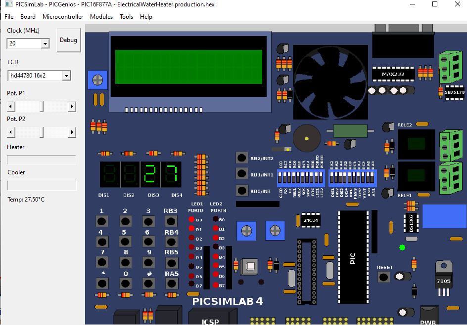

# Electrical Water Heater
* this project is implementaion of the Swift Act requirment of Electrical Water Heater [link](https://github.com/Abdelbary/ElectricWaterHeater/blob/master/Kit_info/Electric%20Water%20Heater.pdf).
* to view full documentation as pdf  [full_doc](https://github.com/Abdelbary/ElectricWaterHeater/blob/master/documentation/doc.pdf).
## Demo
### click image to check demo video 

## Dependencies:
1. PICSimlab simulation program [link](https://github.com/lcgamboa/picsimlab).
2. project developed using MPLAB X IDE from microchip.
3. xc8 compiler from microchip.

##### project documented useing doxygen documentaion in docmentation/html/index.html 
## Main Components:
### Hardware:
The project emulate Electrical Water Heater on PICSimlab simulation program using PicGenios kit with PIC16F877A.

<image src="picture/ProjectSchematic.png"/>

# Software Components:
### Project Static Architecutre:
_Note_: Application calls MCAL directly to inialize the state of LED, Heater and Cooler to off state as there is no 
HAL driver for thoes peripheral_i saw that those peripheral logic is too simple to make a sperated driver for them_.

<image src="picture/projectStaticArchitecture.png"/><image src="picture/initFun.png"/>

### Project Detailed Design:
check detailed Design in [pdf](doucmentation/Detailed Design.pdf)

<image src="picture/DetailedDesign.png"/>

### Tasks TimeLine:
* Project uses a non-primitive operating system with 50ms tick time.
* task periodic time specified in the below graph.
* project has five different tasks {tempTask,ButtonTask,tempControlTask,sevenSegTask} their priority as their listing 
  order with highest priority task [tempTask] and lowest priority is [sevenSegTask].
* the system repeats it's operation every 100ms _Major Cycle_.
* os prehook runs tempTask once to prepare current temp for seven segment display before it's calling.
* operation time of each task is neglectable _no blocking for a considerable amount of time_.

<image src="picture\timeLine.png"/>

### Operating System:
This project uses a non premative OS with a periodic task, the os prority feature is turned off as a result task take it's
priority from the order of its creation relative to other tasks.
The project has five different tasks {tempTask,ButtonTask,tempControlTask,sevenSegTask} their priority as thier listing 
order with highest priority task [tempTask] and lowest priority is [sevenSegTask].

### System Tasks:

#### tempControlTask:
* check if user set a temperature
* if a temp is set then
	1. get the average temp of the last ten readings.
	2. take an action based on the state of the heater and cooler state and the set temp value.
* if the cooler element is on turn on the led if the heater element is on blink led every 1 sec.

#### ButtonTask:
* call button manager.
* update the state of each button{up-down-on/off}.
* if the on-off button is pressed switch the system {on/off} respectively and exit task.
* if in normal mode and up or down button pressed to get the last set value from EXT_EEPROM and change mode to TEMP_SET_MOD.
* if in temp set mode and up or down button pressed to increase or decrease the temp to set by 5 depending on which button pressed respectively.
* if neither the up nor down button pressed to save the set temp to EXT_EEPROM and change mode to normal mode.

#### tempTask:
* Get the latest adc converted value form the ADC chanal connected to temp sensor.
* calculate the current temp in celsius.
* save current temp in _last 10 temp reading_ array.

#### sevenSegTask:
* if in normal mode display the current temp value.
* if in temp set mode flash led every 1sec and display last set temp
  * interact with the user if up or down button pressed to change the temp to set by 5 degrees above or below the current temp based on the button pressed.
  * Max temp 75 and Min temp to set is 35.
